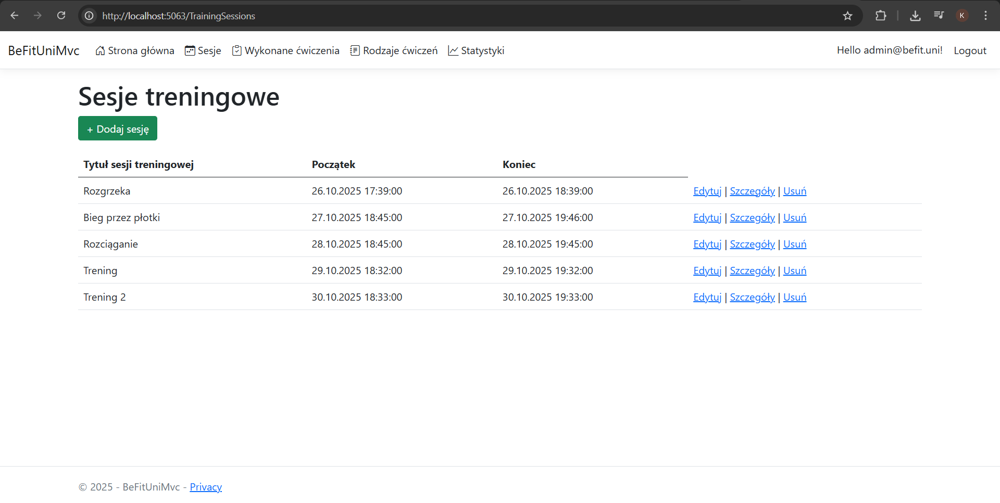
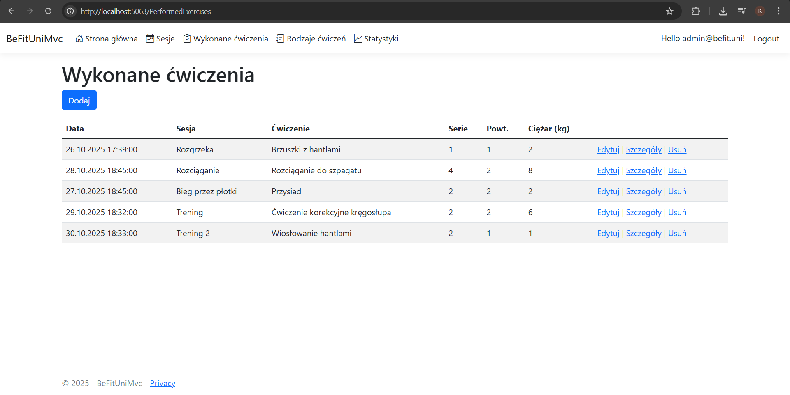
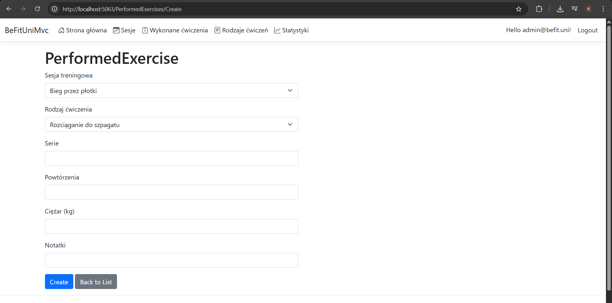
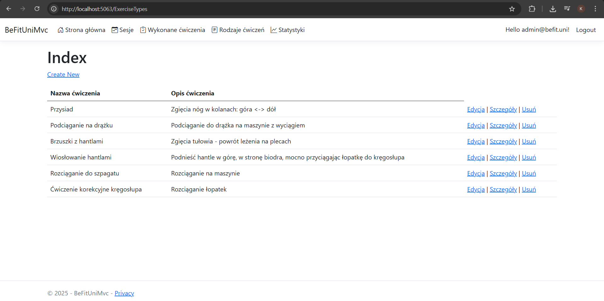
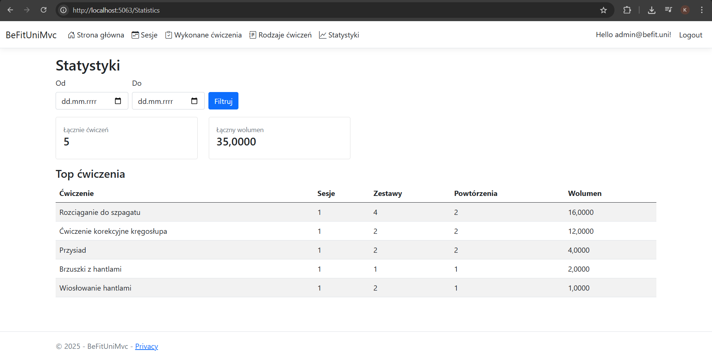

BeFitUniMvc to aplikacja ASP.NET Core MVC realizująca wymagania zadania projektowego, obejmująca system użytkowników, operacje CRUD oraz statystyki aktywności treningowej. Kod źródłowy został udostępniony w publicznym repozytorium GitHub.

Opis projektu

Projekt BeFitUniMvc jest aplikacją webową wykonaną w technologii ASP.NET Core MVC. Został przygotowany w ramach zaliczenia przedmiotu Programowanie zaawansowane – I.
Aplikacja umożliwia użytkownikom prowadzenie ewidencji sesji treningowych, przypisywanie do nich wykonanych ćwiczeń oraz przeglądanie statystyk aktywności.

Projekt wykorzystuje Entity Framework Core jako warstwę ORM oraz ASP.NET Core Identity do obsługi użytkowników i ról. Interfejs użytkownika oparty jest na klasycznych widokach Razor (.cshtml).
Aplikacja nie wykorzystuje technologii Blazor.

Zastosowane technologie

- ASP.NET Core MVC (.NET 8)
- Entity Framework Core
- ASP.NET Core Identity
- Razor Views
- SQL Server (LocalDB)
- Bootstrap

Modele aplikacji
W aplikacji zaimplementowano trzy główne modele:

- ExerciseType – typ ćwiczenia (nazwa, opis, walidacja danych),
- TrainingSession – sesja treningowa użytkownika (data oraz czas rozpoczęcia i zakończenia),
- PerformedExercise – wykonane ćwiczenie w ramach sesji (serie, powtórzenia, obciążenie).

Modele posiadają walidację pól wejściowych oraz relacje zgodne z założeniami zadania.

Funkcjonalności

- rejestracja i logowanie użytkowników,
- role użytkowników (administrator, użytkownik),
- zarządzanie sesjami treningowymi,
- przypisywanie ćwiczeń do sesji,
- pełne operacje CRUD,
- dostęp do danych ograniczony wyłącznie do właściciela,
- zarządzanie typami ćwiczeń dostępne tylko dla administratora.

## Widoki aplikacji

### Sesje treningowe
Widok listy sesji treningowych zalogowanego użytkownika z możliwością dodawania, edycji oraz usuwania sesji.

---

### Wykonane ćwiczenia
Lista wykonanych ćwiczeń przypisanych do sesji treningowych, zawierająca informacje o seriach, powtórzeniach oraz obciążeniu.

Formularz dodawania nowego wykonanego ćwiczenia z automatycznym przypisaniem do sesji i użytkownika.

---

### Rodzaje ćwiczeń
Widok administracyjny umożliwiający zarządzanie typami ćwiczeń dostępnymi w systemie.

---

### Statystyki
Widok statystyk użytkownika prezentujący zagregowane dane treningowe z wybranego zakresu czasu.

Bezpieczeństwo
dane są powiązane z kontem użytkownika,
brak możliwości edycji lub usuwania cudzych danych,
identyfikator użytkownika nie jest przekazywany w formularzach,
operacje administracyjne dostępne wyłącznie dla użytkowników z odpowiednią rolą.

Instrukcja uruchomienia projektu
Wymagania

.NET SDK 8.0
SQL Server (LocalDB lub SQL Server Express)
System Windows

1. Uruchomienie aplikacji
Sklonuj repozytorium: 

git clone https://github.com/krystianmarciniak/BeFitUniMvc.git

2. Przejdź do katalogu projektu:

cd BeFitUniMvc

3. Przywróć zależności:

dotnet restore

4. Zastosuj migracje bazy danych:

dotnet ef database update

5. Uruchom aplikację:

dotnet run

6. Aplikacja będzie dostępna w przeglądarce pod adresem:

http://localhost:5063

Konto testowe
W aplikacji skonfigurowane jest konto administratora, które umożliwia zarządzanie typami ćwiczeń:
- Login: admin@befit.uni
- Hasło: Admin123!

Informacje końcowe
Projekt spełnia wymagania zadania projektowego.
Kod źródłowy znajduje się w publicznym repozytorium GitHub i został udostępniony zgodnie z zasadami pracy z systemem kontroli wersji.